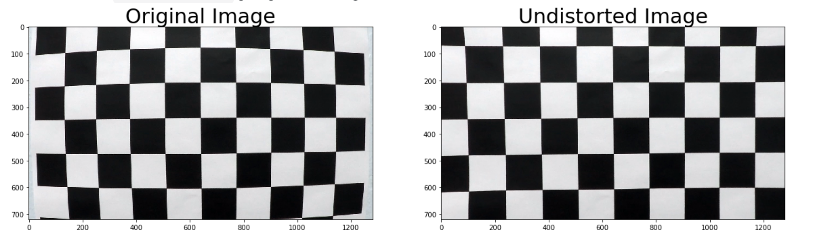

## Advanced Lane Finding

Result
---

The Project
---

The goals / steps of this project were the following:

* Compute the camera calibration matrix and distortion coefficients given a set of chessboard images.
* Apply a distortion correction to raw images.
* Use color transforms, gradients, etc., to create a thresholded binary image.
* Apply a perspective transform to rectify binary image ("birds-eye view").
* Detect lane pixels and fit to find the lane boundary.
* Determine the curvature of tKo9aXgXhe lane and vehicle position with respect to center.
* Warp the detected lane boundaries back onto the original image.
* Output visual display of the lane boundaries and numerical estimation of lane curvature and vehicle position.

RequirementsI
---

* Python3 installed.
* OpenCV library.

Pipeline
---
### Camera Calibration
Due to the curvature of a camera lens, individual frames in a video are distorted. Distortion affects the size and shapes of objects in a video, and can make an object appear closer or farther away then they actually are. To correct for this  used the cv2.findChessboardCorners() method provided by OpenCV which generates a calibration file which applies a coefficient to each frame in the video.

### Perspective Transform

I then transformed the image into a birds eye perspective. This simplifies calculating the curvature of the road lane and allows us to work in a region of interest.
