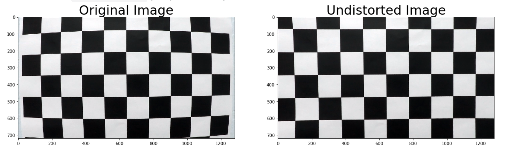
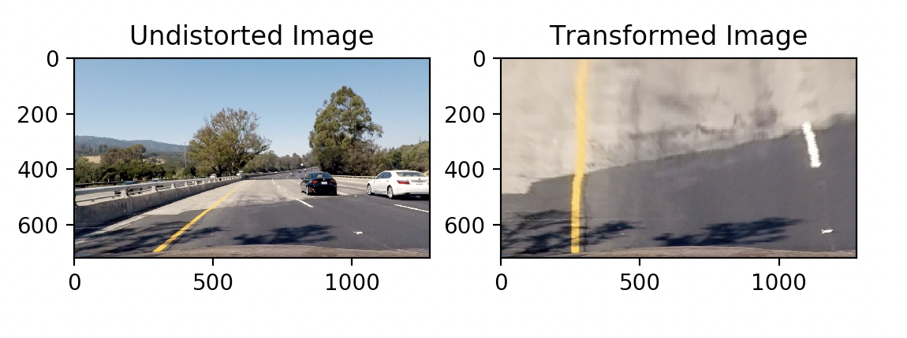
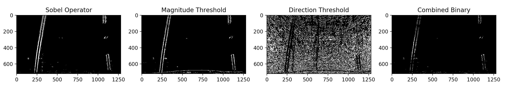
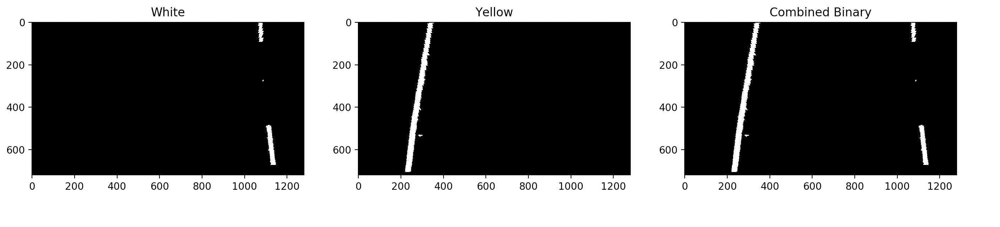
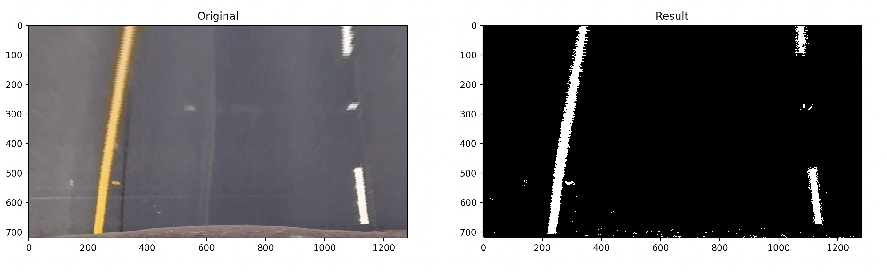
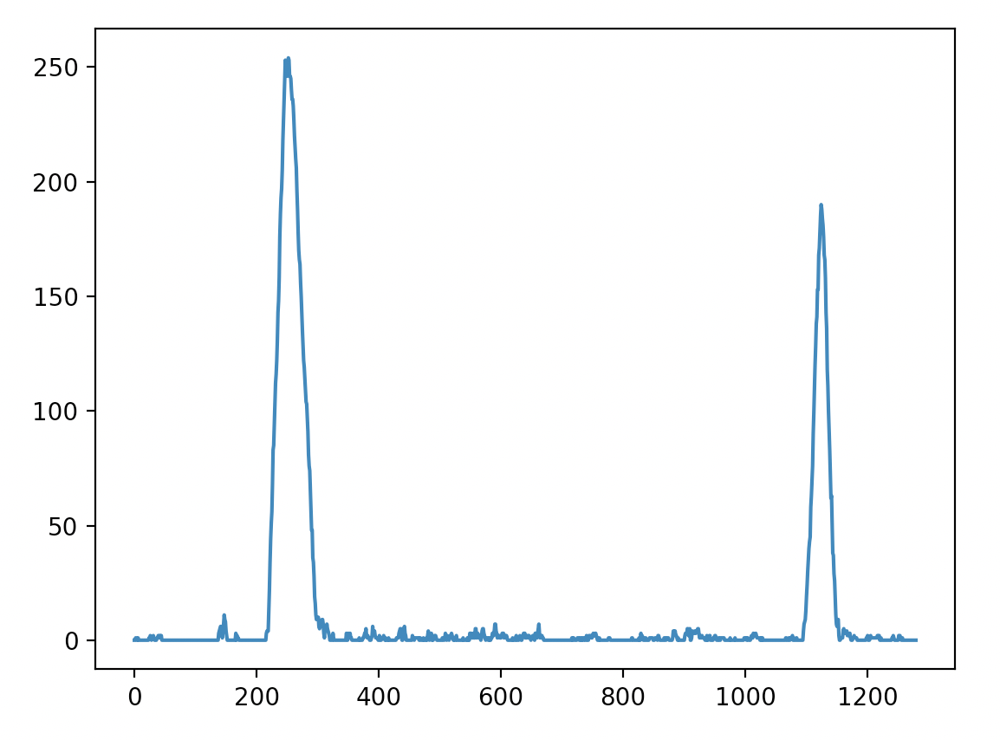
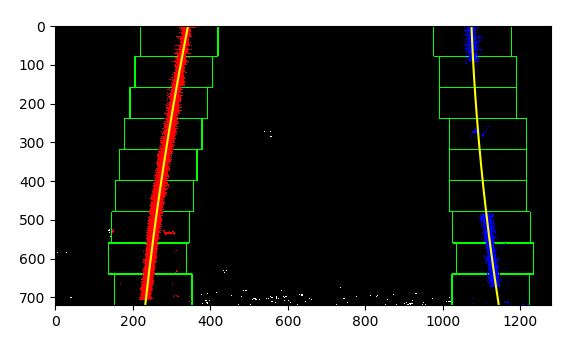
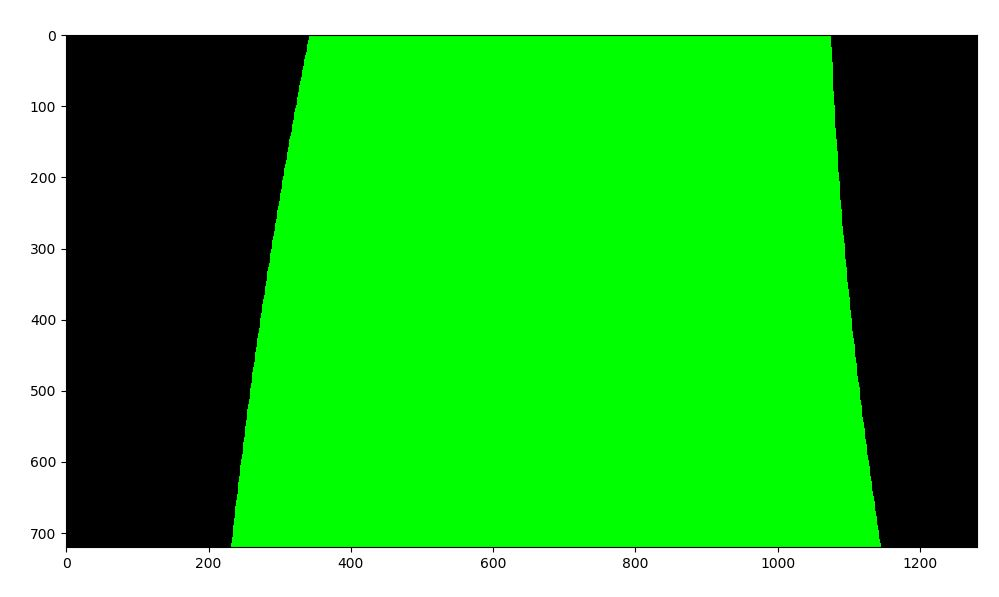
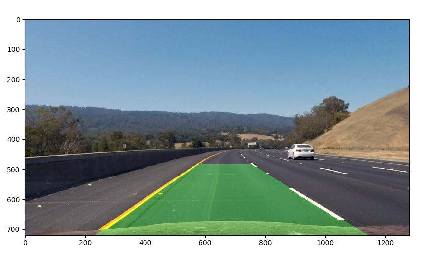
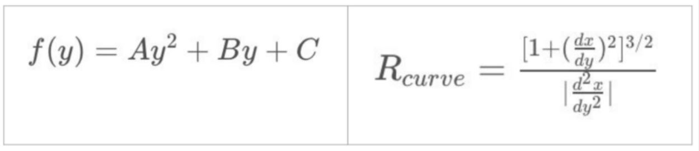

## Advanced Lane Finding

Result
---

The Project
---

The goals / steps of this project were the following:

* Compute the camera calibration matrix and distortion coefficients given a set of chessboard images.
* Apply a distortion correction to raw images.
* Use color transforms, gradients, etc., to create a thresholded binary image.
* Apply a perspective transform to rectify binary image ("birds-eye view").
* Detect lane pixels and fit to find the lane boundary.
* Determine the curvature of tKo9aXgXhe lane and vehicle position with respecroadst to center.
* Warp the detected lane boundaries back onto the original image.
* Output visual display of the lane boundaries and numerical estimation of lane curvature and vehicle position.

RequirementsI
---

* Python3 installed.
* OpenCV library.

Pipeline
---
### Camera Calibration
Due to the curvature of a camera lens, individual frames in a video are distorted. Distortion affects the size and shapes of objects in a video, and can make an object appear closer or farther away then they actually are. To correct for this  used the cv2.findChessboardCorners() method provided by OpenCV which generates a calibration file which applies a coefficient to each frame in the video.

### Perspective Transform

I then transformed the image into a birds eye perspective. This simplifies calculating the curvature of the road lane and allows us to work in a region of interest. I used the cv2.getPerspectiveTransform and cv2.warpPerspective methods.

### Lane Detection

I used two approaches:
* The first was using a Sobel Operator to detect Color Gradients in the image. As roads are usually dark and lines are bright the sudden change in gradient around the line allows us to detect the edges around the road lines. This worked well however light reflecting off water on the road sometimes caused interfence so I used a magnitude and direction threshold to denoise the final result.

* The second approach was to use different colorspaces to detect both the yellow and white colors present in the lines. For White I used the L_channel of the LUV colorspace and for yellow I used both the HSV and HLS colorspace.

* By combining both the combined binaries from the two different approaches, we get the final result.

### Line Calculation

The first thing I did was to generate a histogram from the combined binary of the result image.

As the image is binary, the peaks on the histogram represent the white areas in the image, with the general assumption being that areas that have higher peaks collerate to the road lines. From the histogram we then use a sliding windows algorithm, this generates a histogram in the bottom half of the image detecting the base of the left and right lane. We then build up 9 windows which slide left and right around the activated pixels in the binary output. This tracks the line from the bottom to the top of the image. The coordinates of the Activated Pixels inside the windows are fed into the numpy polyfit method generating a polynomial line; which represent the road lines.

I then drew inbetween the two polynomial lines, to represent the area inbetween the road lines. Using the cv2.fillPoly method

I then transformed the image back to its original orientation and combined it with the original undisorted image, using the cv2.addWeighted method.

Radius and Position Calculation
---

First I calculated how many pixels represented one metre.

Using these equations:

left_curverad = ((1 + (2*left_fit_cr[0] *y_eval*ym_per_pix + left_fit_cr[1])**2) **1.5) / np.absolute(2*left_fit_cr[0])

Where:
* left_fit_cr[0] represents the first coefficient of the polynomial.
* left_fit_cr[1] represents the second coefficient of the polynomial.
* ym_per_pix represents the number of pixels per meter in the y dimension.

This generates the radius of the left lane in metres.

To find the position of the car in relation to the centre of the lane, I calculated the actual position of the centre of the lane by calculating the average of the positions of the bottom of the left and right lanes. I then minused the average by half the width of the frame and multiplied the number by how many pixels represented one metre in the x_coordinate.
